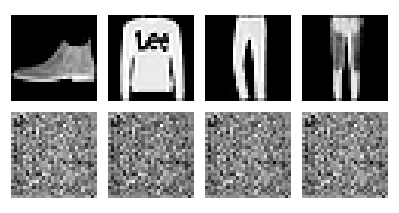
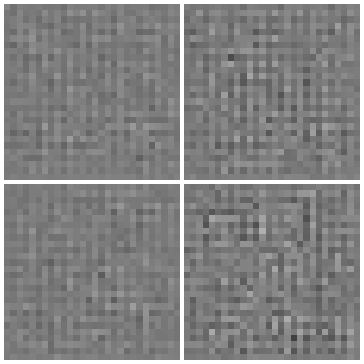
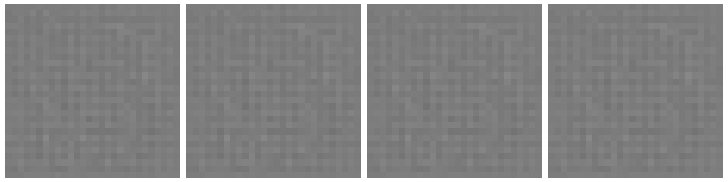
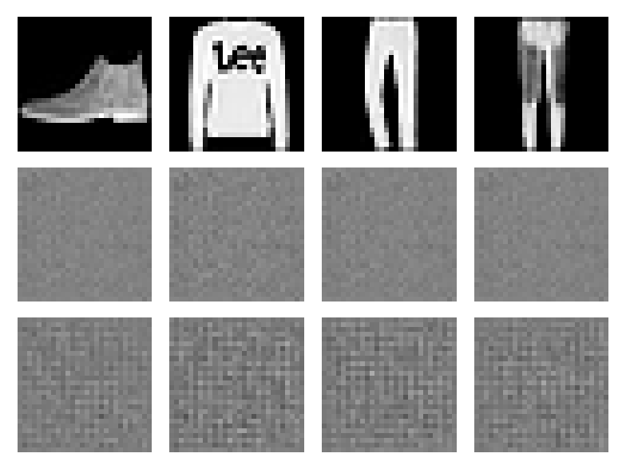

# deep_learning-generative_models

Portfolio project demonstrating Deep Learning and Generative Modeling on Fashion-MNIST through image reconstruction, latent representations, generation, comparison, and a small Tkinter exploration GUI.

The project is intentionally focused: it uses a Convolutional Autoencoder as the Deep Learning reconstruction baseline and a Variational Autoencoder as the generative model. It does not include cloud deployment, authentication, databases, backend APIs, LLM integration, GANs, diffusion models, or unrelated infrastructure.

## What It Shows

- Fashion-MNIST image loading with an explicit tensor contract: `[batch, 1, 28, 28]`.
- Convolutional Autoencoder (AE) training and reconstruction evaluation.
- Variational Autoencoder (VAE) training with reconstruction and KL-divergence losses.
- Small, Medium, and Deep fixed architecture presets for both AE and VAE.
- Checkpoint-based workflows for evaluation, generation, interpolation, comparison, and GUI use.
- AE vs VAE comparison focused on reconstruction loss, qualitative examples, training-loss behavior, and VAE generation capability.
- Tkinter GUI for loading existing checkpoints, reconstructing test images, generating VAE samples, interpolating between latent representations, and editing bounded latent dimensions.

## Install

Requirements:

- Python 3.11+
- `uv`

Install the project dependencies and test tools:

```bash
uv sync --extra dev
```

Run the test suite:

```bash
uv run pytest
```

## Run

Smoke-check the package without training:

```bash
uv run python -m deep_learning_generative_models
```

Inspect the Fashion-MNIST data pipeline:

```bash
uv run python -m deep_learning_generative_models.data_inspect
```

Train a lightweight AE explicitly:

```bash
uv run python -m deep_learning_generative_models.train --model ae --preset small --epochs 1 --train-subset-size 256 --test-subset-size 64
```

Train a lightweight VAE explicitly:

```bash
uv run python -m deep_learning_generative_models.train --model vae --preset small --epochs 1 --train-subset-size 256 --test-subset-size 64
```

Training runs only when the training command is executed. Importing the package or opening the GUI never starts training.

Evaluate an existing AE checkpoint:

```bash
uv run python -m deep_learning_generative_models.evaluate --checkpoint experiments/<ae-experiment>/ae-small-checkpoint.pt --max-samples 128
```

Generate VAE samples and latent interpolations from an existing VAE checkpoint:

```bash
uv run python -m deep_learning_generative_models.generate --checkpoint experiments/<vae-experiment>/vae-small-checkpoint.pt --mode both --count 16 --steps 8 --seed 42
```

Compare existing AE and VAE checkpoints:

```bash
uv run python -m deep_learning_generative_models.compare --ae-checkpoint experiments/<ae-experiment>/ae-small-checkpoint.pt --vae-checkpoint experiments/<vae-experiment>/vae-small-checkpoint.pt --max-samples 128 --generated-count 16 --seed 42
```

Open the Tkinter model explorer:

```bash
uv run python -m deep_learning_generative_models.gui
```

The GUI is an educational layer over trained models. It supports AE/VAE selection, preset descriptions, compatible checkpoint loading, Fashion-MNIST test-image browsing, reconstruction display, VAE random generation, latent interpolation, and bounded latent-vector slider edits.

## Example Smoke Outputs

These images were produced from short local smoke runs and are included to show the artifact pipeline, not final model quality.

The final audit comparison smoke run evaluated 16 Fashion-MNIST samples on CPU with existing checkpoints: AE reconstruction loss `0.185039`, VAE reconstruction loss `0.177022`.

AE reconstruction smoke output:



VAE random generation smoke output:



VAE latent interpolation smoke output:



AE vs VAE reconstruction comparison smoke output:



## Project Layout

```text
src/deep_learning_generative_models/
  config.py
  data.py
  device.py
  evaluate.py
  experiments.py
  generate.py
  compare.py
  gui.py
  models.py
  paths.py
  reproducibility.py
  train.py
configs/
  default.json
docs/
  ARCHITECTURE.md
  PLAN.md
  PROMPTS_BOOK.md
  assets/
tests/
```

Local datasets, checkpoints, experiment directories, caches, IDE files, and virtual environments are ignored by Git.

New experiment directories use readable names such as `ae-small-fashion-mnist-1ep-20260906-181819-9a1b0070`. New training artifacts use names such as `ae-small-checkpoint.pt`, `ae-small-training-history.csv`, `ae-small-config.json`, and `ae-small-metadata.json`. Existing older checkpoints can still be loaded when their explicit path is provided.

## Limitations

- Fashion-MNIST is the only dataset used.
- The included example outputs come from deliberately short smoke runs.
- The GUI loads and explores existing checkpoints; it does not train models.
- The project is not a production ML system and does not include serving, authentication, databases, cloud deployment, or web APIs.

## AI Assistance Disclosure

This project was developed with significant assistance from ChatGPT and Codex for planning, documentation, code generation, review, and repository maintenance. That assistance should not be interpreted as proof of independent mastery of every implementation detail.
